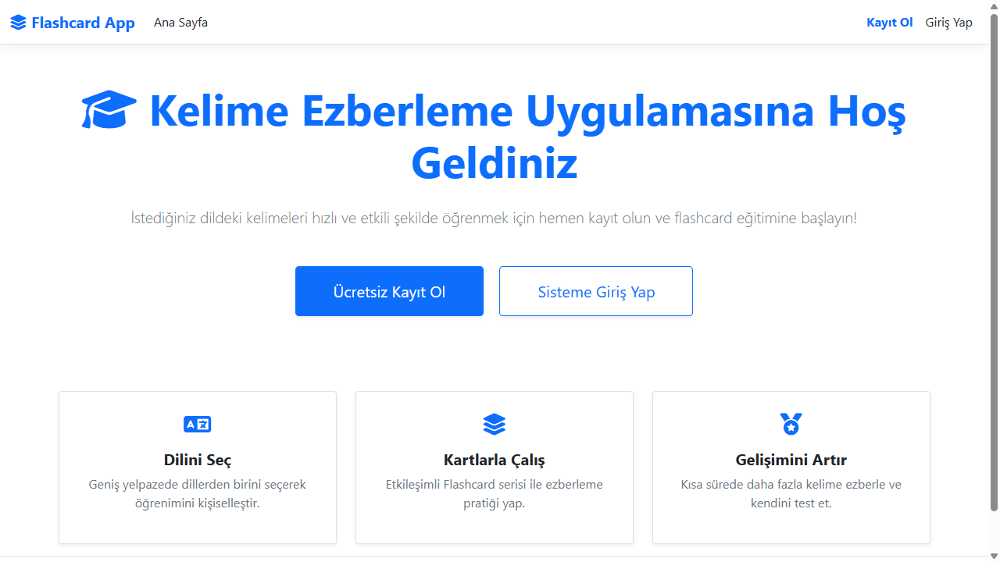
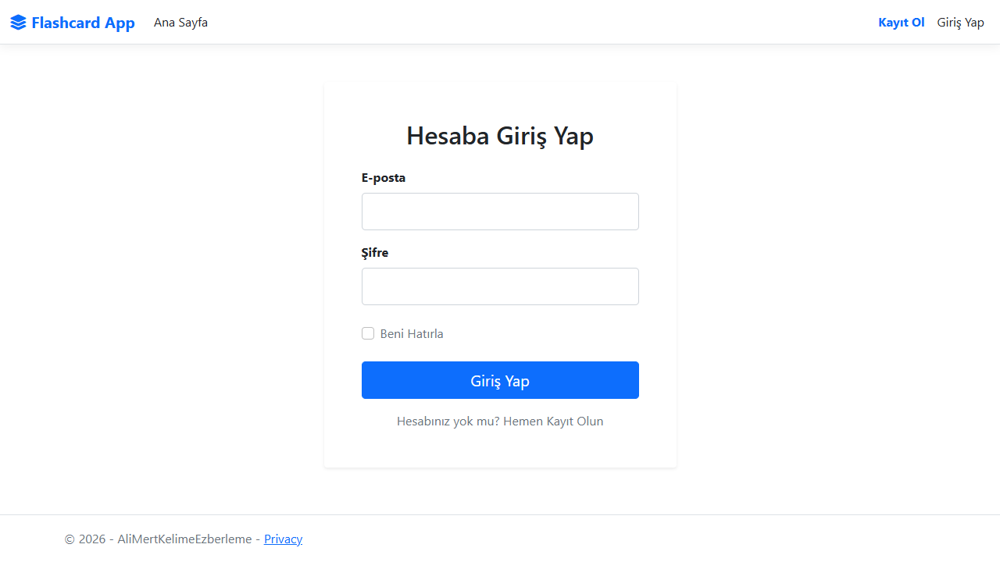

# Ali Mert Kelime Ezberleme

Bu proje bir kelime ezberleme uygulamasıdır. ASP.NET Core MVC kullanılarak geliştirilmektedir.

## Ekran Görüntüleri

### Ana Sayfa

### Giriş Ekranı

## Projeyi Çalıştırma

Projeyi çalıştırmak için Visual Studio veya uyumlu bir IDE kullanabilirsiniz.

1. `.sln` veya `.csproj` dosyasını açın.
2. Gerekli paketlerin yüklenmesini bekleyin.
3. Projeyi derleyip çalıştırın.
